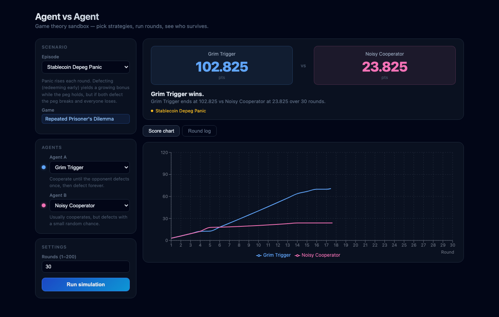

# Agent vs Agent — Game Theory DeFi Lab

A browser-based sandbox for running repeated game-theory simulations with DeFi-native scenarios. Pick two strategies, choose an episode, run up to 200 rounds, and watch who survives.



## Quickstart

Requirements: Node.js 18+, pnpm (or npm/yarn)

```bash
pnpm install
pnpm dev
```

Then open the printed `localhost` URL.

## What's inside

### Games
- **Repeated Prisoner's Dilemma** — canonical T > R > P > S payoffs (5/3/1/0)
- **Stag Hunt** — coordination game; (C,C) is payoff-dominant, (D,D) is risk-dominant

### Strategies (9)
| Strategy | Description |
|---|---|
| Always Cooperate | Always plays C |
| Always Defect | Always plays D |
| Tit-for-Tat | Cooperate first, then mirror opponent |
| Grim Trigger | Cooperate until betrayed, then defect forever |
| Noisy Cooperator | Cooperates 85% of the time |
| Pavlov (Win-Stay, Lose-Shift) | Repeat last action if it paid off, otherwise switch |
| Random | 50/50 each round |
| Suspicious Tit-for-Tat | Like TFT but opens with D |
| Gradual | Punishes N defections with N Ds, then forgives |

### Episodes (scenarios)
| Episode | Game | Description |
|---|---|---|
| Standard | PD | Plain repeated game, fixed payoffs |
| Stablecoin Depeg Panic | PD | Panic rises each round; defecting yields a growing bonus until the peg breaks |
| DeFi Yield War | PD | Two LPs decide each round to stay or rotate; exits shrink TVL and compress payoffs |
| Governance Coordination | Stag Hunt | Agents vote YES/NO on a protocol upgrade; quorum bonuses reward mutual cooperation |

### UI
- Score cards with cumulative totals per agent
- Recharts line chart showing score trajectories over time
- Round log table with Coop/Defect badges, decimal payoffs, running totals
- Strategy descriptions shown inline
- Scenario description and game label auto-update on episode change

## Architecture

```
src/
  core/
    types.ts        — Action, GameContext, GameTemplate, AgentStrategy, ScenarioTemplate
    pd.ts           — Repeated Prisoner's Dilemma
    stag_hunt.ts    — Stag Hunt
    strategies.ts   — All 9 agent strategies
    scenarios.ts    — All 4 scenario templates
    simulation.ts   — runSimulation loop (N rounds, optional scenario)
  App.tsx           — React UI
  style.css         — Dark theme styles
```

## Extending

- **New strategy**: add an `AgentStrategy` object to `strategies.ts` and append to `ALL_STRATEGIES`
- **New game**: implement `GameTemplate` in a new file, add to `GAME_MAP` in `App.tsx`
- **New scenario**: add a `ScenarioTemplate` to `scenarios.ts` and append to `ALL_SCENARIOS`
